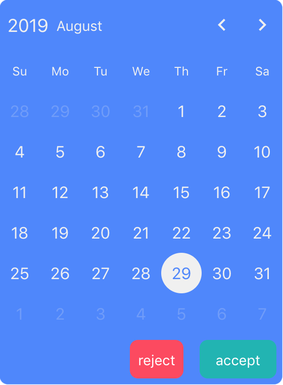
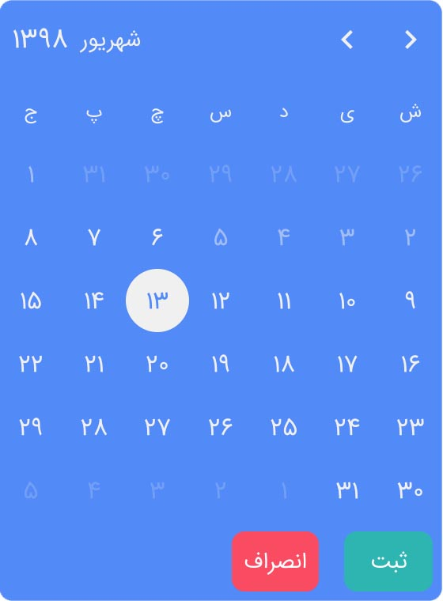

## Locale
react-persian-datepicker also supports gregorian calendar. <br />

### Gregorian
By pass gregorian prop, can use gregorian calendar.
```jsx
<ReactPersianDatepicker
  gregorian={true}
/>
```
Buttons name convert to english one. Week start with Sunday. and some other customizations. <br />
> Default: `false`



> NOTE: Font of datepicker (ex. english or persian numbers) is match with your project font. It's not controlled by gregorian prop.


<br />


## Dates
Here some props for control date. <br />
> NOTE: You can use `[year, month, day]` array OR JS `Date` Object.

### Start Date
You can set a date that user can not pick any date before it.
```jsx
<ReactPersianDatepicker
  startDate={[1398, 6, 6]}
/>
```
In this example, user can only pick 1398/06/06 or the days after it. <br /> <br />


### End Date
```jsx
<ReactPersianDatepicker
  endDate={[1398, 7, 4]}
/>
```
In this example, user can only pick 1398/07/04 or the days before it.

### Selected Date
This prop sets initial selected date.
```jsx
<ReactPersianDatepicker
  selectedDate={[1398, 6, 12]}
/>
```
In this example, before user select another date, this date marks as selected. <br />
> Default: `Today`


<br />


## Customized Buttons
You can create your own buttons for some buttons like month navigators. they will show on default buttons places.

### Month Navigators
With this prop can set customized button for month navigators. <br />
It is useful for the times that have custom fonts like `Material Icons`.
```jsx
<ReactPersianDatepicker
  monthNavigators={{ left: <i className="material-icons">chevron_left</i>, right: <i className="material-icons">chevron_right</i> }}
/>
```
> Default: `&lsaquo;`&lsaquo; character for left, `&rsaquo;`&rsaquo; character for right


<br />


## Styles
Some props for control color and other styles of datepicker.

### Primary Color
This prop sets primary color of datepicker. for example selected-day color pick from primary color.
```jsx
<ReactPersianDatepicker
  primaryColor="rgb(79, 135, 251)"
/>
```
> Default: `rgb(252, 74, 96)`

### Secondary Color
This prop sets secondary color of datepicker. for example days color pick from secondary color.
```jsx
<ReactPersianDatepicker
  secondaryColor="rgb(240, 240, 240)"
/>
```
> Default: `rgb(255, 255, 255)`

### Small
With set small prop true, you got a smaller version of datepicker
```jsx
<ReactPersianDatepicker
  small={true}
/>
```
> Default: `false`

### Style Object
with this prop you can set inline styles for container of datepicker. <br />
For example you can put datepicker on the middle of screen. Or you can set some radius around it. Or everything else in style.
```jsx
<ReactPersianDatepicker
  style={{ position: 'absolute', top: '0', right: '0', bottom: '0', left: '0', margin: 'auto', borderRadius: '8px' }}
/>
```

## Actions
Control buttons action.

### On Change
This function calls when selectedDate changed. It will receive new selectedDate as an argument.
```jsx
<ReactPersianDatepicker
  onChange={(selectedDate) => { console.log(selectedDate); }}
/>
```

> NOTE: If you use `dialog` around datepicker, This function is good place for `dismiss` dialog. Or resolve promise. Or things like that.