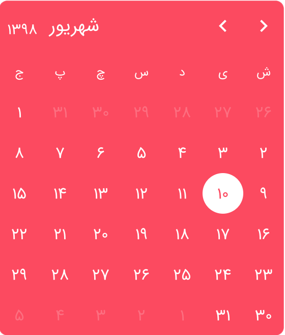

# Types Of Picker

## Standalone
The first and recommended way for using `react-persian-datepicker` is standalone component. <br />
You can use this any where you want. For example you can have your own dialog and use this datepicker inside it, Or show datepicker on screen without extra stuff, Or whatever you want. <br />
This is the core of other components in this package. <br />
This type of datepicker is in default export. You can use it like the below:
```jsx
import React from 'react';
import ReactPersianDatepicker from '@socit/react-persian-datepicker';

function App() {
  return (
      <ReactPersianDatepicker
        onChange={(date) => { console.log(date); }}
      />
  );
}

export default App;
```


## Input
If you want `react-persian-datepicker` do all works for you, there is `input` type for doing that. <br />
With this type of datepicker you have an input for let user type date (Beta) or click on it for select date from datepicker. <br />
All changes can catch with `onChange` event like standalone component. <br />
For using `input` you can simply import `ReactPersianDatepickerInput` from `react-persian-datepicker` like below:
```jsx
import React from 'react';
import { ReactPersianDatepickerInput } from '@socit/react-persian-datepicker';

function App() {
  return (
      <ReactPersianDatepickerInput
        onChange={(date) => { console.log(date); }}
      />
  );
}

export default App;
```


## Dialog
Doc complete soon...